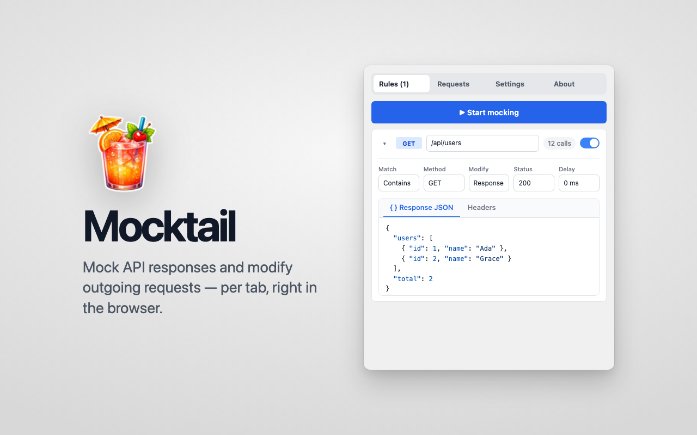
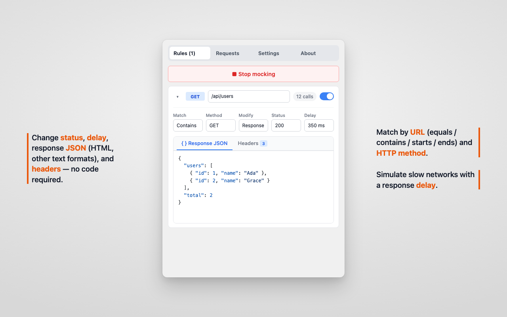
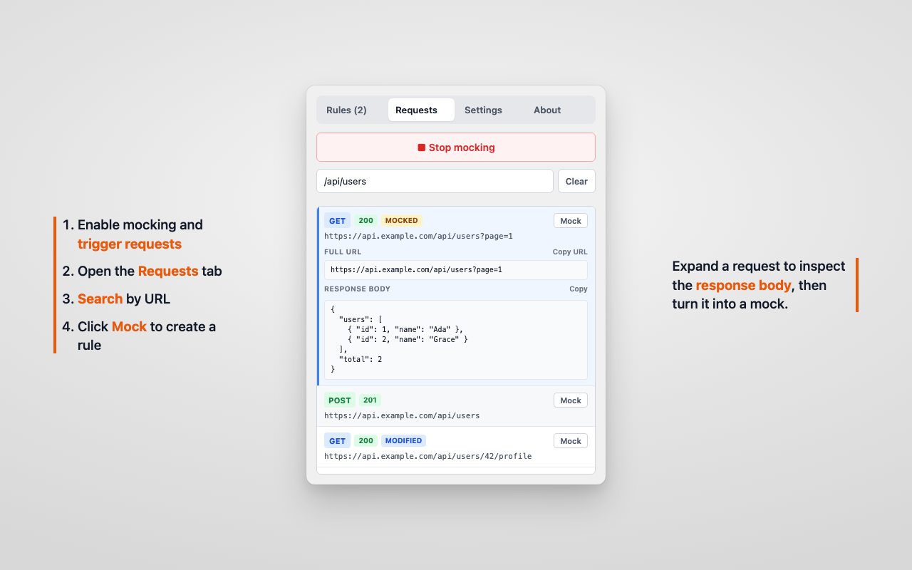
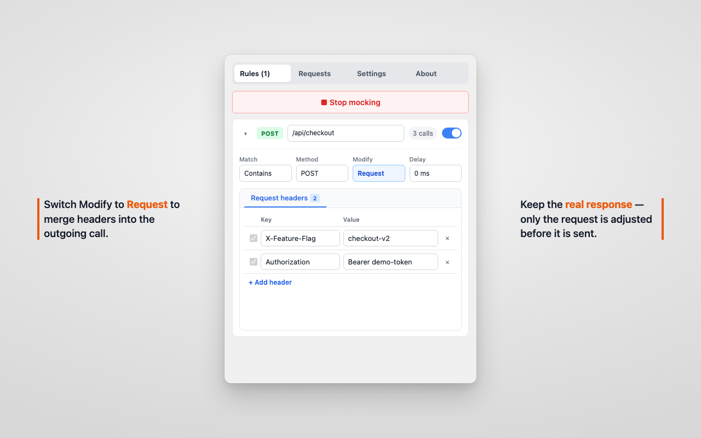
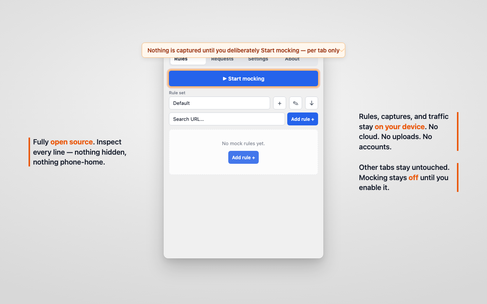

<p align="center">
  
</p>

<h1 align="center">Mocktail</h1>

<p align="center">
  <strong>Mock APIs in the browser — without coding or waiting on the backend.</strong>
</p>

<p align="center">
  Shape responses, tweak outgoing requests, and ship UI faster.<br />
  Local only. Open source.
</p>

<p align="center">
  <a href="#get-started">Get started</a> ·
  <a href="https://denis-fateev.github.io/mocktail/privacy.html">Privacy</a> ·
  <a href="./LICENSE">MIT License</a>
</p>

<br />

<p align="center">
  
</p>

## What you can do

<table>
  <tr>
    <td width="50%" valign="top">
      <p align="center">
        
      </p>
      <p><strong>Own the response</strong><br />
      Set status, delay, body, and headers. Empty lists, 500s, slow networks — on demand.</p>
    </td>
    <td width="50%" valign="top">
      <p align="center">
        
      </p>
      <p><strong>Capture, then mock</strong><br />
      Inspect real traffic in Requests and turn any call into a rule in one click.</p>
    </td>
  </tr>
  <tr>
    <td width="50%" valign="top">
      <p align="center">
        
      </p>
      <p><strong>Shape the request</strong><br />
      Inject headers or add delay before send — keep the real response when you only need the request changed.</p>
    </td>
    <td width="50%" valign="top">
      <p align="center">
        
      </p>
      <p><strong>Stay private by design</strong><br />
      Mocking is off until you enable it. Rules and captures never leave your machine.</p>
    </td>
  </tr>
</table>

## Built for everyday frontend work

- **Prototype before the API exists** — unblock UI with realistic JSON, status codes, and timing
- **Test the hard paths** — empty states, auth failures, timeouts, flaky networks
- **Isolate one tab** — enable mocking only where you need it; everything else stays untouched
- **Organize with rule sets** — switch contexts, import/export JSON, or draft rules with an AI-friendly prompt helper
- **Work in a side panel** — stays open next to your page while you iterate

## Get started

**Requirements:** Chrome 114+ · Node.js 20+ (to build from source)

```bash
npm install
npm run build
```

1. Open `chrome://extensions`
2. Turn on **Developer mode**
3. Click **Load unpacked** and select the `dist` folder
4. Open the Mocktail side panel from the toolbar

For live reload while developing:

```bash
npm run dev
```

| Command                               | What it does                         |
| ------------------------------------- | ------------------------------------ |
| `npm run build`                       | Production build → `dist/`           |
| `npm run package`                     | Build + zip for the Chrome Web Store |
| `npm run dev`                         | Watch mode                           |
| `npm run lint` / `typecheck` / `test` | Quality checks                       |

## How it works

When you start mocking on a tab, Mocktail attaches via Chrome’s Debugger API and evaluates your enabled rules from top to bottom.

A rule matches on **URL** (equals / contains / starts with / ends with) and **HTTP method** (or `ANY`).

| Mode         | What happens                                                                     |
| ------------ | -------------------------------------------------------------------------------- |
| **Response** | Intercept and fulfill with your status, body, headers, and delay                 |
| **Request**  | Keep the real response; merge headers into the outgoing request (optional delay) |

The first matching rule of each type wins. If both types match, the **response** rule takes priority. Unmatched traffic passes through as usual.

> Why `debugger`? It’s how Chrome lets Manifest V3 extensions pause and fulfill network requests reliably. Mocking stays off until you explicitly enable it for a tab. Details: [Privacy Policy](https://denis-fateev.github.io/mocktail/privacy.html).

## Privacy you can trust

Mocktail does **not** send captured traffic anywhere. There is no cloud, no analytics SDK, and no account.

Rules, settings, and request history stay in your browser. Full details: [Privacy Policy](https://denis-fateev.github.io/mocktail/privacy.html) · [source](./PRIVACY.md).

## Feedback

Bug reports, ideas, questions, or support for the project are welcome — email [denisprof2@gmail.com](mailto:denisprof2@gmail.com) or open a GitHub issue.

---

<p align="center">
  <sub>MIT License · Icon notices in <a href="./public/THIRD_PARTY_NOTICES.md">THIRD_PARTY_NOTICES</a></sub>
</p>
